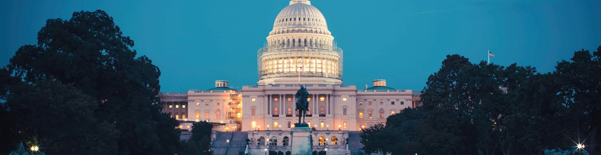

### Hi there, I'm Oscar!
# Welcome to my Github! 👋
- 🏋️ I'm currently workout on a gym booking app
- 💻 I work as a SWE Intern [@Adaptive](https://www.adaptivebiotech.com/)
  - prev ML & SWE Intern [@CACI](https://www.caci.com/)
- 📚 I study Computer Science and Data Science [@Purdue](https://www.purdue.edu/)
- 📍 Based in D.C

<!--
**osu28/osu28** is a ✨ _special_ ✨ repository because its `README.md` (this file) appears on your GitHub profile.

Here are some ideas to get you started:

- 🔭 I’m currently working on ...
- 🌱 I’m currently learning ...
- 👯 I’m looking to collaborate on ...
- 🤔 I’m looking for help with ...
- 💬 Ask me about ...
- 📫 How to reach me: ...
- 😄 Pronouns: ...
- ⚡ Fun fact: ...
-->
